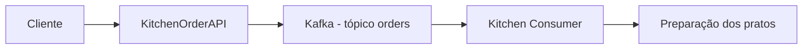
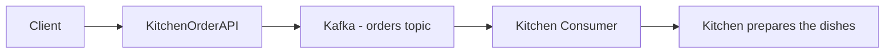
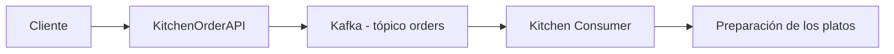

# KitchenOrderAPI-Kafka - Arquitetura / Architecture / Arquitectura

## 📑 Índice / Index / Índice
- [🇧🇷 Português](#-português)
- [🇺🇸 English](#-english)
- [🇪🇸 Español](#-español)

---

## 🇧🇷 Português

### 1. Introdução
A **KitchenOrderAPI-Kafka** é uma API Restful em **.NET 8** para gerenciamento de pedidos de cozinha.  
Ela utiliza **Apache Kafka** como mensageria para comunicação assíncrona e escalável.

### 2. Visão Geral
Fluxo principal:

### 3. Componentes
- **KitchenOrderAPI**: Controllers, Services, Kafka Producer  
- **KitchenOrderAPI.Tests**: Testes unitários e de integração  
- **Kafka**: Tópico `orders`, Producer e Consumer  

### 4. Fluxo de Dados
1. Cliente envia pedido via `/api/orders`  
2. API valida e publica no Kafka  
3. Consumidor lê do tópico `orders`  
4. Pedido é processado pela cozinha  

### 5. Tecnologias
- .NET 8 WebAPI  
- Apache Kafka  
- Docker Compose  
- Swagger  
- xUnit  
- Serilog  

---

## 🇺🇸 English

### 1. Introduction
**KitchenOrderAPI-Kafka** is a Restful API built with **.NET 8** for kitchen order management.  
It uses **Apache Kafka** as a messaging system for scalable and asynchronous communication.

### 2. Overview
Main flow:

### 3. Components
- **KitchenOrderAPI**: Controllers, Services, Kafka Producer  
- **KitchenOrderAPI.Tests**: Unit and integration tests  
- **Kafka**: `orders` topic, Producer and Consumer  

### 4. Data Flow
1. Client sends order via `/api/orders`  
2. API validates and publishes to Kafka  
3. Consumer reads from `orders` topic  
4. Kitchen processes the order  

### 5. Technologies
- .NET 8 WebAPI  
- Apache Kafka  
- Docker Compose  
- Swagger  
- xUnit  
- Serilog  

---

## 🇪🇸 Español

### 1. Introducción
**KitchenOrderAPI-Kafka** es una API Restful en **.NET 8** para la gestión de pedidos de cocina.  
Utiliza **Apache Kafka** como sistema de mensajería para comunicación escalable y asíncrona.

### 2. Visión General
Flujo principal:

### 3. Componentes
- **KitchenOrderAPI**: Controllers, Services, Kafka Producer  
- **KitchenOrderAPI.Tests**: Pruebas unitarias e integración  
- **Kafka**: Tópico `orders`, Producer y Consumer  

### 4. Flujo de Datos
1. Cliente envía pedido vía `/api/orders`  
2. API valida y publica en Kafka  
3. Consumidor lee del tópico `orders`  
4. Cocina procesa el pedido  

### 5. Tecnologías
- .NET 8 WebAPI  
- Apache Kafka  
- Docker Compose  
- Swagger  
- xUnit  
- Serilog  